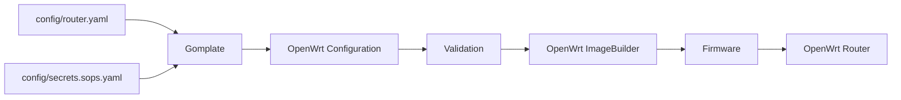

<div align="center">

# HX Net Lab

**Network-as-code for a reproducible [OpenWrt](https://openwrt.org/) router firmware.**

[](https://github.com/Hovirix/netlab/releases)
[](https://github.com/Hovirix/netlab/actions/workflows/check.yml)
[](https://downloads.openwrt.org/releases/25.12.4/)

</div>

HX Net Lab defines the homelab network from a small declarative configuration. Network policy, services, and firmware are rendered from code, validated, and built into a reproducible OpenWrt image.

______________________________________________________________________

## Contents

- [Architecture](#architecture)
- [Design Principles](#design-principles)
- [Network](#network)
- [Configuration](#configuration)
- [Repository](#repository)
- [Operations](#operations)
- [Security](#security)
- [Recovery](#recovery)
- [License](#license)

## Architecture



## Design Principles

| Principle | What it means here |
| ------------------------- | --------------------------------------------------------------------------------------- |
| Infrastructure as Code | Network configuration is versioned and reproducible. |
| Declarative Configuration | Desired network state is defined in YAML rather than configured manually. |
| Default Deny | Network access is blocked unless explicitly allowed. |
| Secrets Management | [SOPS](https://github.com/getsops/sops) keeps sensitive configuration encrypted in Git. |
| Automated Operations | [Task](https://taskfile.dev/) provides repeatable build and deployment workflows. |

## Network

| Layer | Technology | Role |
| ------------ | -------------------------------------------------------------- | --------------------------------- |
| Router | [OpenWrt](https://openwrt.org/) | Network control plane |
| Segmentation | VLANs | Network isolation |
| Firewall | OpenWrt Firewall | Routing policy and access control |
| VPN | [WireGuard](https://www.wireguard.com/) | Remote access |
| DNS | [AdGuard Home](https://adguard.com/adguard-home/overview.html) | DNS and filtering |
| DHCP | [dnsmasq](https://thekelleys.org.uk/dnsmasq/doc.html) | Address allocation |
| Wireless | OpenWrt | Wi-Fi networks |

The complete topology, VLANs, firewall policy, DHCP, wireless configuration, and router services are declared in [`config/router.yaml`](config/router.yaml).

## Configuration

| Source | Purpose |
| ------------------------------------------------------ | ------------------------------------------------------------------------- |
| [`config/router.yaml`](config/router.yaml) | Network and firmware desired state |
| [`config/secrets.sops.yaml`](config/secrets.sops.yaml) | Encrypted runtime secrets |
| [`templates/`](templates/) | [Gomplate](https://docs.gomplate.ca/) templates for OpenWrt configuration |

The configuration model and encrypted secrets are rendered into an OpenWrt filesystem overlay, validated, and passed to [OpenWrt ImageBuilder](https://openwrt.org/docs/guide-user/additional-software/imagebuilder) to produce the firmware.

## Repository

```text
.
├── config/             # Network model and encrypted secrets
├── templates/          # OpenWrt configuration templates
├── scripts/            # Build and deployment implementation
├── keys/               # Public verification keys
├── .github/workflows/  # CI and update automation
├── Taskfile.yml        # Operational interface
├── flake.nix           # Development environment
└── AGENTS.md           # Architecture and agent context
```

Network state is declared as code rather than duplicated in static documentation. `AGENTS.md` and AI agent skills provide queryable architecture, operational, and recovery knowledge when needed.

## Operations

[Task](https://taskfile.dev/) is the primary operational interface.

```bash
task             # List available commands
task check       # Run static checks
task build       # Render, validate, and build firmware
task deploy      # Build and flash the router
task update      # Update OpenWrt build metadata
task clean       # Remove generated build state
```

A reproducible development environment is provided through [Nix](https://nixos.org/):

```bash
nix develop
```

Rendering, validation, firmware generation, deployment, and recovery are automated to keep changes and incident recovery fast and repeatable. AI agent context and domain-specific skills provide queryable knowledge to inspect network policy, diagnose incidents, and guide the appropriate recovery workflow.

## Security

- Router input and inter-network forwarding follow a default-deny model.
- VLANs define explicit network security boundaries.
- Firewall access is declared with explicit source, destination, protocol, and port rules.
- Remote administration uses WireGuard with explicitly granted access.
- SSH password authentication is disabled.
- Secrets remain encrypted with SOPS in Git.
- CI operates without runtime secrets.
- Generated and decrypted build state remains outside version control.

## Recovery

- Network state is reproducible from Git.
- Encrypted secrets provide the runtime state required for a complete rebuild.
- `task build` recreates the router firmware from the declared configuration.
- `task deploy` flashes the generated firmware and reapplies the declared state.
- AI agent skills provide queryable recovery procedures instead of static runbooks.

## License

Distributed under the [MIT License](LICENSE).
